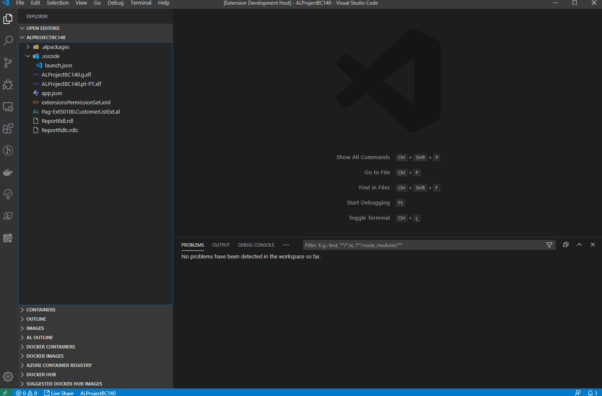
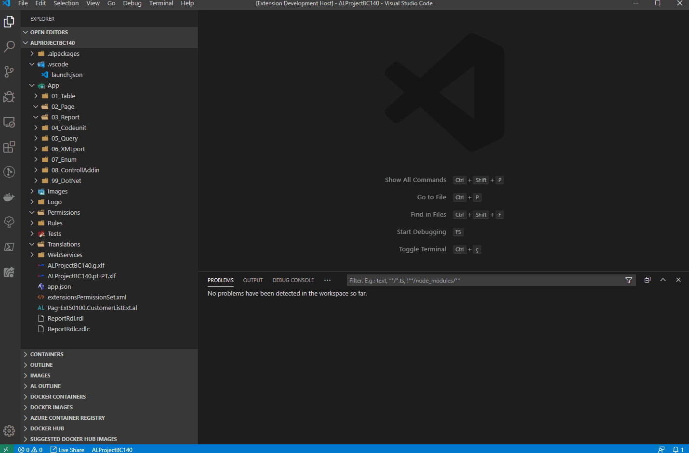

# AL Structure Creator

## Features

This extension allows you to create the folder structure for AL projects.

---

## Requirements

* `Dynamics 365 Business Central`.
* `Visual Studio Code`.

---

## Extension Settings

This extension contributes the following settings:

* `ALStructureCreator.AppSubfolderType`: This configuration defines which type of application/object folder you want to create, if **Numbered**, **Named** or **None**.
* `ALStructureCreator.CreateExtObjFolder`: This configuration allows you to create extension/customer subfolder for application type object (e.g.: **TableCust**,**TableExt**, ..).
* `ALStructureCreator.ErrorOnExistFolder`: If set to **true** this configuration raise an error if the project folder already exists.
* `ALStructureCreator.ObjectPrefix.<ObjectType>`: This set of configuration defines the prefix of application object file so it can be reorganized in the corresponding application folder.

---

## Extension Commands

This extension contributes the following commands:

* `ES: Create All Folder Structure`: This command create all application folder structure for AL projects.
* `ES: Create Table Folder`: This command create the **table** application folder for AL projects.
* `ES: Create Page Folder`: This command create the **page** application folder for AL projects.
* `ES: Create Report Folder`: This command create the **report** application folder for AL projects.
* `ES: Create Codeunit Folder`: This command create the **codeunit** application folder for AL projects.
* `ES: Create Query Folder`: This command create the **query** application folder for AL projects.
* `ES: Create XMLport Folder`: This command create the **xmlport** application folder for AL projects.
* `ES: Create Enum Folder`: This command create the **enum** application folder for AL projects.
* `ES: Create ControllAddin Folder`: This command create the **controlladdin** application folder for AL projects.
* `ES: Create DotNet Folder`: This command create the **dotnet** application folder for AL projects.
* `ES: Reorganize Objects`: This command move the applications objects from the root folder to the corresponding application folder.

---

## Known Issues

There are no reported issues.

---

## Release Notes

Updated release **0.1.0**.

#### Added
- New command to move/**reorganize** application objects to the corresponding application folders.
- New configurations to be used in the new command.
- New folder validations.

#### Removed
- Configuration `ProjectFolderOption`.

#### View [Change Log](https://github.com/edyspider/ALStructureCreator/blob/master/CHANGELOG.md)

-----------------------------------------------------------------------------------------------------------

## Authors

* [**EdySpider**](https://github.com/edyspider/)

---

## License

- **[MIT license](https://github.com/edyspider/ALStructureCreator/blob/master/LICENSE)**
- Copyright 2020 &copy; <a href="https://github.com/edyspider" target="_blank">EdySpider</a>.

---

## Credits

* [Javier Fuentes](https://github.com/Microsoft/AL/issues/4224#issuecomment-439719319)
* [Van Huynh](https://itnext.io/how-to-make-a-visual-studio-code-extension-77085dce7d82)
