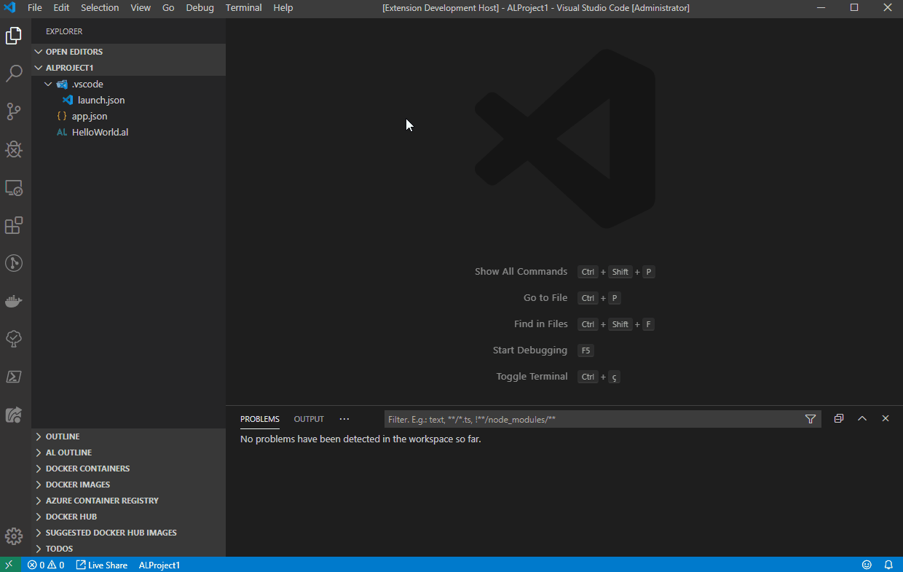

# AL Structure Creator

## Features

This extension allows you to create the folder structure for AL projects.

---

## Requirements

* `Dynamics 365 Business Central`.
* `Visual Studio Code`.

---

## Extension Settings

This extension contributes the following settings:

* `ALStructureCreator.AppSubfolderType`: This configuration defines which type of application/object folder you want to create, if **Numbered**, **Named** or **None**.
* `ALStructureCreator.CreateExtObjFolder`: If set to **true** allows you to create extension/developer subfolder for all application type object (e.g.: **TableCust**,**TableExt**, ..).
* `ALStructureCreator.ErrorOnExistFolder`: This configuration allows you to create the AL structure in the project root or create a new folder every time you want create the AL structure.
* `ALStructureCreator.ErrorOnExistFolder`: If set to **true** this configuration raise an error if the project folder already exists..

---

## Known Issues

There are no reported issues.

---

## Release Notes

This is a pre-release.

### 0.0.1

Initial release of AL folder structure creator.

-----------------------------------------------------------------------------------------------------------

## Authors

* [**EdySpider**](https://github.com/edyspider/)

---

## License

- **[MIT license](https://github.com/edyspider/ALStructureCreator/blob/master/LICENSE)**
- Copyright 2020 © <a href="https://github.com/edyspider" target="_blank">EdySpider</a>.

---

## Credits

* [Javier Fuentes](https://github.com/Microsoft/AL/issues/4224#issuecomment-439719319)
* [Van Huynh](https://itnext.io/how-to-make-a-visual-studio-code-extension-77085dce7d82)
