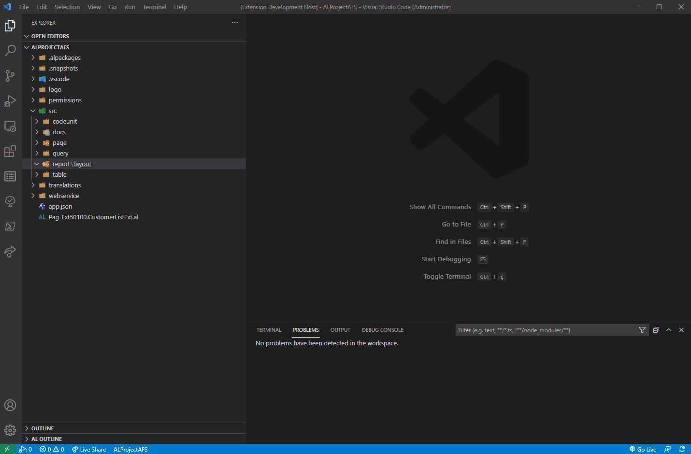
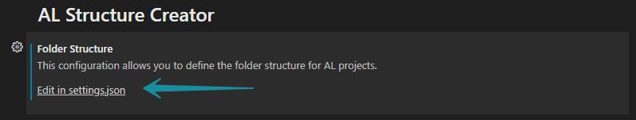

  
  <h1 align="center">AL Structure Creator</h1>

  
  
  
  
  

## Features

This extension allows you to create the folder structure for AL projects and help you organize the application files.
You can also customize the standard structure or use other names to create a folder structure that best suits you.

---

## Requirements

* `Dynamics 365 Business Central`.
* `Visual Studio Code`.

---

## Extension Settings

This extension contributes the following settings:

* `ALStructureCreator.FolderStructure`: This configuration allows you to define the folder structure for AL projects that best suits you.
* `ALStructureCreator.ObjectIdentification`: This configuration defines how to identify the objects files, by the object prefix/suffix filename or reading the file. **Prefix**,**Suffix** or **Object** (e.g: `TabEmployeMgt.al`,`EmployeeMgtTab.al`, `..OBJECT Table 50010`).
* `ALStructureCreator.ObjectIdent.<ObjectType>`: This configuration defines how to identify a specific object file by its prefix/suffix name.

The **ObjectIdent**/**ObjectIdentification.** settings are used for the action to reorganize the project files inside a specific folder.

---

## Customization

You can add your own structure to the default settings but it's important that you follow the existing properties as it is.
<table>
  <tr>
    <th>Property</th>
    <th>Example</th>
    <th>Description</th>
  </tr>
  <tr>
    <td>Folder Key</td>
    <td>doc</td>
    <td>Key name of the folder</td>
  </tr>
  <tr>
    <td>Name</td>
    <td>--docs</td>
    <td>Name of the folder when created</td>
  </tr>
  <tr>
    <td>Auto-Carete</td>
    <td>--true</td>
    <td>To automatically create the folder when call "Create All Folder Structure" command</td>
  </tr>
  <tr>
    <td>Subfolder</td>
    <td>--subfolder</td>
    <td>To add subfolders inside the main folder</td>
  </tr>
</table>

---

## Extension Commands

This extension contributes the following commands:

* `ES: Create All Folder Structure`: This command create all application folder structure for AL projects.
* `ES: Create Folder Structure`: This command create a defined application folder for AL projects. Follow the allowed application folders/subfolders and shortcut name.
<table>
  <tr>
    <th>Folder Code/Structure</th>
    <th>Folder Name</th>
    <th>Shortcut/Parameter</th>
  </tr>
  <tr>
    <td>logo</td>
    <td>logo</td>
    <td>log/logo  </td>
  </tr>
  <tr>
    <td>object</td>
    <td>src</td>
    <td>src/obj/object</td>
  </tr>
  <tr>
    <td>--codeunit</td>
    <td>codeunit</td>
    <td>cod/codeunit</td>
  </tr>
  <tr>
    <td>--controladdin</td>
    <td>controladdin</td>
    <td>ctrl/controladdin</td>
  </tr>
  <tr>
    <td>--dotnet</td>
    <td>dotnet</td>
    <td>dnet/dotnet</td>
  </tr>
  <tr>
    <td>--entitlement</td>
    <td>entitlement</td>
    <td>ent/entitlement</td>
  </tr>
  <tr>
    <td>--enum</td>
    <td>enum</td>
    <td>enu/enum</td>
  </tr>
  <tr>
    <td>--interface</td>
    <td>interface</td>
    <td>int/interface</td>
  </tr>
  <tr>
    <td>--page</td>
    <td>page</td>
    <td>pag/page</td>
  </tr>
  <tr>
    <td>--permissionset</td>
    <td>permissionset</td>
    <td>pers/permissionset</td>
  </tr>
  <tr>
    <td>--profile</td>
    <td>profile</td>
    <td>pro/profile</td>
  </tr>
  <tr>
    <td>--query</td>
    <td>query</td>
    <td>que/query</td>
  </tr>
  <tr>
    <td>--report</td>
    <td>report</td>
    <td>rep/report</td>
  </tr>
  <tr>
    <td>----layout</td>
    <td>layout</td>
    <td>lay/layout</td>
  </tr>
  <tr>
    <td>--requestpage</td>
    <td>requestpage</td>
    <td>req/requestpage</td>
  </tr>
  <tr>
    <td>--table</td>
    <td>table</td>
    <td>tab/table</td>
  </tr>
  <tr>
    <td>--xmlport</td>
    <td>xmlport</td>
    <td>xml/xmlport</td>
  </tr>
  <tr>
    <td>permission</td>
    <td>permissions</td>
    <td>perm/permission</td>
  </tr>
  <tr>
    <td>test</td>
    <td>tests</td>
    <td>tst/test</td>
  </tr>
  <tr>
    <td>translation</td>
    <td>translations</td>
    <td>tran/translations</td>
  </tr>
  <tr>
    <td>webservice</td>
    <td>webservices</td>
    <td>wb/webservice</td>
  </tr>
</table>

* `ES: Reorganize Objects`: This command move the applications objects from the root folder to the corresponding application folder.

---

## Known Issues

There are no reported issues.

---

## Release Notes

Updated release **0.3.0**.

#### Added Features
- New configuration in json format that allows to customize the default al folder structure.
- New general action to create specific folder.
- New configurations to identify type of object/files.

#### View [Change Log](https://github.com/edyspider/ALStructureCreator/blob/master/CHANGELOG.md)

-----------------------------------------------------------------------------------------------------------

## Authors

* [**EdySpider**](https://github.com/edyspider/)
* [**Éder Leal da Silva**](https://github.com/ederlealsilva/)

---

## License

- **[MIT license](https://github.com/edyspider/ALStructureCreator/blob/master/LICENSE)**
- Copyright 2020 &copy; <a href="https://github.com/edyspider" target="_blank">EdySpider</a>.
